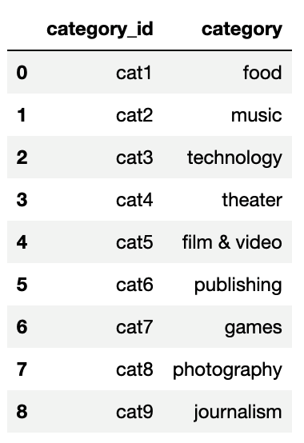

# GP02-Crowdfunding_ETL

## File Location
- 
- 
- 

## Instructions
The instructions for this mini project are divided into the following subsections:

Create the Category and Subcategory DataFrames
Create the Campaign DataFrame
Create the Contacts DataFrame
Create the Crowdfunding Database
Create the Category and Subcategory DataFrames
Extract and transform the crowdfunding.xlsx Excel data to create a category DataFrame that has the following columns:

A "category_id" column that has entries going sequentially from "cat1" to "catn", where n is the number of unique categories

A "category" column that contains only the category titles

The following image shows this category DataFrame:

Export the category DataFrame as category.csv and save it to your GitHub repository.

Extract and transform the crowdfunding.xlsx Excel data to create a subcategory DataFrame that has the following columns:

A "subcategory_id" column that has entries going sequentially from "subcat1" to "subcatn", where n is the number of unique subcategories

A "subcategory" column that contains only the subcategory titles

The following image shows this subcategory DataFrame:

Export the subcategory DataFrame as subcategory.csv and save it to your GitHub repository.

Create the Campaign DataFrame
Extract and transform the crowdfunding.xlsx Excel data to create a campaign DataFrame has the following columns:

The "cf_id" column

The "contact_id" column

The "company_name" column

The "blurb" column, renamed to "description"

The "goal" column, converted to the float data type

The "pledged" column, converted to the float data type

The "outcome" column

The "backers_count" column

The "country" column

The "currency" column

The "launched_at" column, renamed to "launch_date" and with the UTC times converted to the datetime format

The "deadline" column, renamed to "end_date" and with the UTC times converted to the datetime format

The "category_id" column, with unique identification numbers matching those in the "category_id" column of the category DataFrame

The "subcategory_id" column, with the unique identification numbers matching those in the "subcategory_id" column of the subcategory DataFrame

The following image shows this campaign DataFrame:

Export the campaign DataFrame as campaign.csv and save it to your GitHub repository.

Create the Contacts DataFrame
Choose one of the following two options for extracting and transforming the data from the contacts.xlsx Excel data:

Option 1: Use Python dictionary methods.

Option 2: Use regular expressions.

If you chose Option 1, complete the following steps:

Import the contacts.xlsx file into a DataFrame.
Iterate through the DataFrame, converting each row to a dictionary.
Iterate through each dictionary, doing the following:
Extract the dictionary values from the keys by using a Python list comprehension.
Add the values for each row to a new list.
Create a new DataFrame that contains the extracted data.
Split each "name" column value into a first and last name, and place each in a new column.
Clean and export the DataFrame as contacts.csv and save it to your GitHub repository.
If you chose Option 2, complete the following steps:

Import the contacts.xlsx file into a DataFrame.
Extract the "contact_id", "name", and "email" columns by using regular expressions.
Create a new DataFrame with the extracted data.
Convert the "contact_id" column to the integer type.
Split each "name" column value into a first and a last name, and place each in a new column.
Clean and then export the DataFrame as contacts.csv and save it to your GitHub repository.
Check that your final DataFrame resembles the one in the following image:

Create the Crowdfunding Database
Inspect the four CSV files, and then sketch an ERD of the tables by using QuickDBDLinks to an external site..

Use the information from the ERD to create a table schema for each CSV file.

Note: Remember to specify the data types, primary keys, foreign keys, and other constraints.

Save the database schema as a Postgres file named crowdfunding_db_schema.sql, and save it to your GitHub repository.

Create a new Postgres database, named crowdfunding_db.

Using the database schema, create the tables in the correct order to handle the foreign keys.

Verify the table creation by running a SELECT statement for each table.

Import each CSV file into its corresponding SQL table.

Verify that each table has the correct data by running a SELECT statement for each.

Hints
To split each "category & sub-category" column value into "category" and "subcategory" column values, use df[["new_column1","new_column2"]] = df["column"].str.split(). Make sure to pass the correct parameters to the split() function.

To get the unique category and subcategory values from the "category" and "subcategory" columns, create a NumPy array where the array length equals the number of unique categories and unique subcategories from each column. For information about how to do so, see numpy.arangeLinks to an external site. in the NumPy documentation.

To create the category and subcategory identification numbers, use a list comprehension to add the "cat" string or the "subcat" string to each number in the category or the subcategory array, respectively.

For more information about creating a new Pandas DataFrame, see the pandas.DataFrameLinks to an external site. in the Pandas documentation.

To convert the "goal" and "pledged" columns to the float data type, use the astype() method.

To convert the "launch_date" and "end_date" UTC times to the datetime format, see the Transform_Grocery_Orders_Solved.ipynb activity solution.

For more information about how to add the "category_id" and "subcategory_id" unique identification numbers to the campaign DataFrame, see the pandas.DataFrame.mergeLinks to an external site. in the Pandas documentation.

Support and Resources
Your instructional team will provide support during classes and office hours. You will also have access to learning assistants and tutors to help you with topics as needed. Make sure to take advantage of these resources as you collaborate with your partner on this project.

Requirements
A Category DataFrame is Created (15 points)
The DataFrame contains a "category_id" column that has entries going sequentially from "cat1" to "catn", where n is the number of unique categories (5 points)
The DataFrame has a "category" column that contains only the category titles (5 points)
The category DataFrame is exported as category.csv (5 points)
A Subcategory DataFrame is Created (15 points)
The DataFrame contains a "subcategory_id" column that has entries going sequentially from "subcat1" to "subcatn", where n is the number of unique subcategories (5 points)
The DataFrame contains a "subcategory" column that contains only the subcategory titles (5 points)
The subcategory DataFrame is exported as subcategory.csv (5 points)
A Campaign DataFrame is Created (30 points)
The DataFrame has the following columns: (25 points)
A "cf_id" column
A "contact_id" column
A "company_name" column
A "description" column
A "goal" column that is a float data type
A "pledged" column that is a float data type
An "outcome" column
A "backers_count" column
A "country" column
A "currency" column
A "launch_date" with the time formatted as "YYYY-MM-DD"
An "end_date" with the time formatted as "YYYY-MM-DD"
A "category_id" column that contains the unique identification numbers matching those in the "category_id" column of the category DataFrame
A "subcategory_id" column that contains the unique identification numbers matching those in the "subcategory_id" column of the subcategory DataFrame
The campaign DataFrame is exported as campaign.csv (5 points)
A Contacts DataFrame is Created (15 points)
The DataFrame has the following columns: (10 points)
A "contact_id" column
A "first_name" column
A "last_name" column
An "email" column
The contacts DataFrame is exported as contacts.csv (5 points)
A Crowdfunding Database is Created (25 points)
A database schema labeled, crowdfunding_db_schema.sql is created (5 points)
A crowdfunding_db is created using the crowdfunding_db_schema.sql file (5 points)
The database has the appropriate primary and foreign keys and relationships (5 points)
Each CSV file is imported into the appropriate table without errors (5 points)
The data from each table is displayed using a SELECT * statement (5 points)
This project will be evaluated against the requirements and assigned a grade according to the following table: